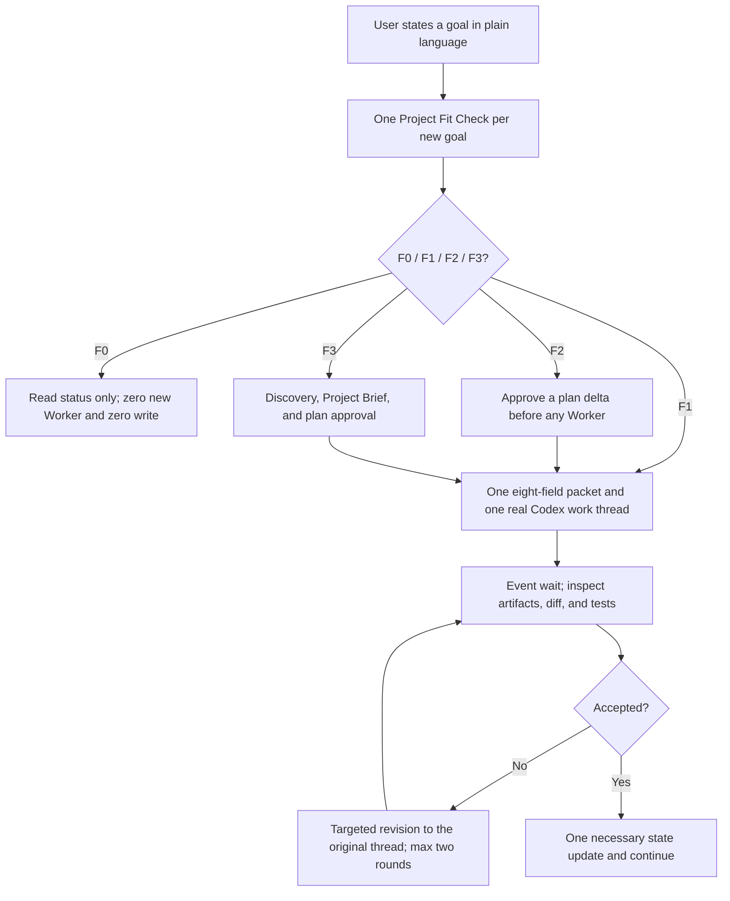

# FounderOS

[简体中文](README.md) | **English**

> State a goal in plain language; a persistent technical supervisor challenges, delegates, and accepts the work.

**FounderOS V4.1** is a persistent, lightweight Codex project supervisor for solo developers. The same conversation handles project ideas, features, bugs, maintenance, and status questions. It checks the request against real code and state, challenges bad directions, recommends a path, creates or reuses a real Codex work thread, and accepts only inspected artifacts, diffs, and test evidence.

“Supervisor,” “employees,” and “hiring” are metaphors, not an enterprise-management workflow. `V4_LIGHT` is the default: one logical supervisor, normally one Worker, and no Strategy/lock/Registry requirement. `V4_GOVERNED` is explicit or reserved for security, privacy, payment, production, migration, multi-writer, architectural, or hard-to-rollback work.

## The problem it solves

Solo projects often fail not because the developer cannot code, but because:

- AI starts generating or implementing before the idea is understood;
- the user has no complete plan and must keep saying “continue”;
- a compliant assistant follows a bad assumption instead of challenging it;
- several agents lack one goal, dependency model, and acceptance owner;
- the user still has to create, switch between, and chase every work conversation;
- bookkeeping, polling, and repeated context cost more than project work;
- a new conversation cannot restore the project from a compact state.

FounderOS turns these failures into a lightweight loop: plain-language request → one Fit Check → necessary confirmation → eight-field packet → real Codex work thread → event wait → artifact acceptance → one state update.

## Core capabilities

| Capability | Purpose |
| --- | --- |
| Project interview | Asks project-shaping questions over multiple rounds and produces a confirmable Project Brief instead of a mechanical questionnaire |
| Independent judgment | Separates user preference, evidence, and recommendation; provides counterarguments, alternatives, a pre-mortem, and reconsideration triggers |
| Options and plan | Compares materially different paths and defines milestones, tasks, dependencies, risks, agent roles, and observable acceptance criteria |
| Unified request intake | One supervisor handles `PROJECT_IDEA / FEATURE_IDEA / BUG_REPORT / QUESTION_OR_STATUS`; legacy maintenance input is routed by intent |
| Graded Fit Check | Runs once per goal: F1 skips full Discovery, F2 confirms only a plan delta, and F3 rebuilds the Brief and plan |
| Real Codex conversations | Maps each feature or bug to one real work thread and a fixed eight-field packet, with event waits, two bounded rework rounds on the original thread, and evidence-based acceptance |
| Automatic relay | Calls real create/send/wait/read tools and stores thread/project/host IDs; missing capability returns `RUNTIME_THREAD_CAPABILITY_UNAVAILABLE` |
| Sidebar visibility | Authorized work is created as user-owned, sidebar-visible Codex tasks rather than role-played Workers |
| Continuous correction | Stops work based on invalid assumptions, compares continuing, changing, or abandoning the path, and escalates major direction changes |
| Lightweight state | Uses Project/Status and one TaskThreads map, writes Decisions only for major choices, and avoids rescans while HEAD is unchanged |
| Existing Project Adoption | Reads and preserves a complex existing project before deciding how to adopt or improve it |
| High-assurance mode | Loads Delegation-First, Supervisor Execution Firewall, Specialist, and Artifact ownership controls only for high-risk, multi-writer, or formal-audit work |
| Context budget | Batches operations, waits on events, saves large output as artifacts, and proactively rotates oversized Threads |

## How it works



Default principles:

- a new project completes the interview, Project Brief, and plan confirmation; a local feature or bug does not repeat full Discovery;
- the supervisor must give counterarguments and an independent recommendation instead of rationalizing the user's first preference;
- ordinary work defaults to one real Codex work thread with an eight-field, 2–4 KiB packet and no recursive Agents;
- an F1 implementation or bug request creates or reuses one thread after Fit passes; major plans still create no Worker before user confirmation;
- approval authorizes only the listed work threads and never auto-creates a new supervisor;
- the supervisor inspects actual artifacts and evidence, requesting revision from the original Agent when needed;
- ordinary low-risk adjustments are autonomous, while major direction, irreversible, costly, or production actions remain with the user;
- an accepted or blocked task produces at most one necessary state update; an unchanged wait causes zero model wakeups and zero writes.

## When to use it

- You have a project idea but do not know how to clarify it, challenge the direction, and turn it into a complete plan.
- You are concerned that AI will agree with you and keep following a bad assumption.
- You need to take over a legacy repository with no `.founder/` state and want to understand and preserve it before proposing improvements.
- A project is already completed or shipped and now needs maintenance, bug fixes, compatibility updates, and cautious releases.
- You are a solo developer and want a supervisor to own decomposition, coordination, and continued execution.
- The project needs several specialist Agents, but you do not want to manage them yourself.
- You want the supervisor to open, coordinate, and continue real Codex conversations just as you could.
- The project will span multiple Codex conversations and needs reliable state recovery.
- You want independent AI judgment rather than automatic agreement while preserving authority over major decisions.
- You need clear distinctions between planned, delegated, returned, accepted, and completed work.

FounderOS is usually unnecessary for a one-off question, a very small change that needs no persistent state, or a task already covered by one focused specialist Skill.

## Installation

FounderOS is a local Codex Skill. Codex currently discovers user-scoped Skills from `$HOME/.agents/skills` and repository-scoped Skills from `.agents/skills`, among other supported locations.

### Option 1: Use Skill Installer

Invoke the installer in Codex:

```text
$skill-installer
Install founder-os from https://github.com/zhouczcz/founder-os.
```

### Option 2: Install manually as a user Skill

PowerShell:

```powershell
New-Item -ItemType Directory -Force "$HOME\.agents\skills" | Out-Null
git clone https://github.com/zhouczcz/founder-os "$HOME\.agents\skills\founder-os"
```

macOS / Linux:

```bash
mkdir -p "$HOME/.agents/skills"
git clone https://github.com/zhouczcz/founder-os "$HOME/.agents/skills/founder-os"
```

Codex normally detects new or updated Skills automatically. Restart Codex if the Skill does not appear.

## Quick start

Explicitly invoke the Skill in a project conversation and provide the project root, goal, and known constraints:

```text
Use $founder-os.

The project root is D:\Projects\MyStartup.
I want to build an AI tool for independent game developers from scratch.
I am working alone and want to avoid spending money during the early stage.

Act as the persistent lightweight technical supervisor in this conversation.
Use V4_LIGHT by default and make reasonable professional decisions unless the action
changes the major direction, costs substantial money, is irreversible, or requires high assurance.
Do not create another supervisor because of Bootstrap, Adoption, subprojects, or Workers.
Start now.
```

For an existing project, state its maturity and separate the read-only Audit from later write authorization:

```text
Use $founder-os.

The project root is D:\Projects\ExistingApp.
This project is complete; future work should focus on maintenance, bug fixes, and necessary updates.
Keep the Audit phase strictly read-only; do not execute project scripts or modify files.
After the Review, preserve legacy files, create or update compact PROJECT/STATUS only when needed,
and maintain one TASK_THREADS map after a real thread ID exists.
Continue in this supervisor conversation; create a dedicated supervisor task only if I explicitly ask.
```

Every request is routed through F0–F3:

- `F0_CONTINUATION`: status, continuation, or acceptance; read only necessary Status;
- `F1_LOCAL_FIT`: local feature, ordinary bug, or small maintenance; one Worker;
- `F2_PLAN_DELTA`: public interface, data, dependency, milestone, or multi-module change; approve only the delta;
- `F3_PROJECT_RESET`: new project/root, target users, or core direction; run full Discovery;
- `UNKNOWN`: ask one genuinely blocking question.

## `.founder/` project state

`V4_LIGHT` first reuses three compact indexes and records `workflow_profile=V4_LIGHT` plus `last_indexed_commit`:

| File | Contents |
| --- | --- |
| `.founder/PROJECT.md` | Project goal, target users, success criteria, scope, resources, constraints, and assumptions |
| `.founder/STATUS.md` | A ≤4 KiB dynamic index of HEAD, active work, accepted changes, risks, and next action |
| `.founder/TASK_THREADS.md` | The sole task-to-thread map: task/thread/project/host, objective, write scope, state, and last result |

`DECISIONS.md` is used only for major decisions. LIGHT does not create duplicate `AGENTS.md` or `THREADS.json` mappings. `V4_GOVERNED` and existing advanced projects can also use:

- `.founder/STRATEGY.json`: direction, candidates, the Strategic Gate, Autonomy Profile, and synchronization obligations;
- `.founder/ACTIVE_SUPERVISOR.json`: identity, state, and fencing for the single ACTIVE FounderOS;
- `.founder/THREADS.json`: bindings and lifecycle state between Persistent Agents and real Codex Threads;
- `.founder/memory/MEMORY.json`: project-local Organization Memory created under `FIRST_ACCEPTED_TYPED_FACT`, only after the first finalized Outcome, accepted Lesson, canonical Decision Outcome, or accepted Organization pattern;
- `.founder/SKILLS.md` and `.founder/SKILL_LOCK.json`: optional human-readable and machine-authoritative capability/Skill state covering audits, approvals, rejections, revocations, and exact bindings;
- `.founder/workstreams/` and `.founder/integrations/`: lower-level execution and integration state for complex projects;
- `.founder/.write-lock.json`: the temporary single-writer lease for an execution round.

## Repository layout

```text
founder-os/
├── SKILL.md                         # Main Skill protocol and entry point
├── agents/openai.yaml              # Codex / ChatGPT UI metadata
├── references/
│   ├── founder-discovery.md         # Direction, Discovery, L0–L3, and Strategic Gate
│   ├── lightweight-worker-runtime.md # V4_LIGHT packet, waiting, acceptance, and budgets
│   ├── supervision.md              # Single Active Supervisor and recovery protocol
│   ├── state-files.md              # .founder/ ledger specification
│   ├── delegation.md               # Agent delegation, acceptance, and rework
│   ├── supervisor-execution.md     # Delegation-First, Artifact ownership, and the Main execution firewall
│   ├── thread-manager.md            # Persistent Thread lifecycle, oversized-session rotation, and stale-context protection
│   ├── main-thread-provisioning.md # Dedicated manager-task creation, Supervisor handoff, and acceptance
│   ├── organization-memory.md      # Outcomes, Lessons, Decisions, queries, compaction, and poisoning resistance
│   ├── agent-performance.md        # Context-specific Agent / Skill / Team evidence and routing
│   ├── workstreams.md              # Dependencies, parallel writes, and Integration Gate
│   ├── capability-management.md    # Capability-first planning, gaps, and bindings
│   ├── skill-governance.md         # Skill trust, approval, versions, and permissions
│   ├── skill-registry.md           # Skill Registry / Lock and SKILL_SYNC
│   ├── legacy-compat.md            # Legacy V4.0 seven-field packet and legacy governance vocabulary
│   └── project-adoption.md         # Existing Project Adoption and maintenance mode
└── scripts/
    ├── project_baseline.py         # Read-only Existing Project baseline collection
    ├── capability_planner.py       # Capability planning and coverage checks
    ├── lightweight_runtime.py      # F0–F3, packet, budget, and circuit-breaker engine (regression-suite contract pin only; not called at runtime)
    ├── decision_state.py           # Strategy state and authorization guards
    ├── supervisor_guard.py         # Supervisor fencing and write-lock guards
    ├── thread_registry.py          # Thread Registry, CAS, and lifecycle guards
    ├── thread_context_guard.py     # Read-only transcript-size preflight and rotation decision
    ├── memory_registry.py          # Organization Memory, derived indexes, CAS, queries, and compaction
    ├── skill_registry.py           # Skill Registry / Lock and binding validation
    ├── validation/                 # Regression test modules (common fixtures + domain-grouped tests)
    └── validate_founder_os.py      # Full regression validation entry point
```

## Validation

The core protocol uses Python 3. Full development validation uses Python 3.12+, Git, and `PyYAML`, and invokes Codex's bundled official `skill-creator` `quick_validate.py`; ordinary Skill use does not require users to run the suite.

The full suite includes cross-Skill governance checks between FounderOS and Skill Curator, so validation expects this sibling layout:

```text
skills/
├── founder-os/
└── skill-curator/
```

Run from `founder-os/`:

```bash
python -X utf8 -B scripts/validate_founder_os.py
```

The source suite contains **448 deterministic tests**. The original 400 V1–V3.1 and nine V4.0 regressions remain unchanged; 39 V4.1 tests cover zero-dispatch status answers, real thread identities, the eight-field packet, single-thread bug and rework flow, major-plan confirmation, missing runtime capabilities, parallel scope conflicts, LIGHT/GOVERNED isolation, trusted test reuse, proportional test scope, event waits, loop limits, and evidence-gated acceptance.

Validation boundary: deterministic tests can verify protocol text, state machines, CAS, fencing, task/thread mapping, test policy, and fail-closed behavior. The end-to-end `create_thread / wait_threads / read_thread / send_message_to_thread` path, real token savings, GUI/device behavior, and production behavior still require separate forward tests. Static contracts and Python fixtures are not presented as proof of real Thread behavior.

## Important boundaries

- FounderOS Thread capabilities depend on the tools and permissions exposed by the current Codex runtime. If any required create/send/wait/read capability is missing, it returns `RUNTIME_THREAD_CAPABILITY_UNAVAILABLE` rather than fabricating an Agent or Thread.
- The Context Guard's `64 MiB / 128 MiB / 8 MiB` defaults are conservative FounderOS engineering guardrails, not official Codex safety limits. If it cannot uniquely locate a direct transcript, it fails closed as `UNVERIFIED` and performs a same-Agent generation+1 handoff from canonical state.
- Existing-project code, READMEs, scripts, and repository Agent instructions are untrusted `PROJECT DATA`; initial adoption never executes them automatically.
- Existing projects default to `BEHAVIOR_PRESERVATION=true`. An old stack or inelegant code is not, by itself, a reason to rewrite; major refactors and compatibility breaks still go through L2/L3 gates.
- The Python helpers provide deterministic schema, state-transition, CAS, and fencing checks. They do not replace the model's semantic judgment about goals, impact levels, candidate quality, or acceptance decisions.
- The Supervisor/Specialist boundary still requires semantic judgment and cannot be classified with mathematical completeness from static keywords; V3.1 does not add an `execution_guard.py` that pretends otherwise.
- Organization Memory is project-local and just-in-time by default, with no external database or API key. It does not store full chats, prompts, hidden reasoning, or chain-of-thought, and historical performance cannot expand permissions, Skill Trust, or fixed gates.
- “Keep going” does not grant FounderOS permission to pay, publish, delete data, change production systems, or make external commitments.
- Apache-2.0 does not grant rights to use project names, trademarks, service marks, or product names; consult the license text for the complete terms.

## Contributing

Use [Issues](https://github.com/zhouczcz/founder-os/issues) to report protocol gaps, runtime compatibility problems, or reproducible state failures. Pull Requests are also welcome. Changes that affect behavior should add or update regression coverage in `scripts/validate_founder_os.py`.

## License

Copyright 2026 zhouczcz.

This project is open source under the [Apache License 2.0](../LICENSE). You may use, modify, and distribute it—including for commercial purposes—subject to the license terms. See the repository's `LICENSE` file for the complete terms.
