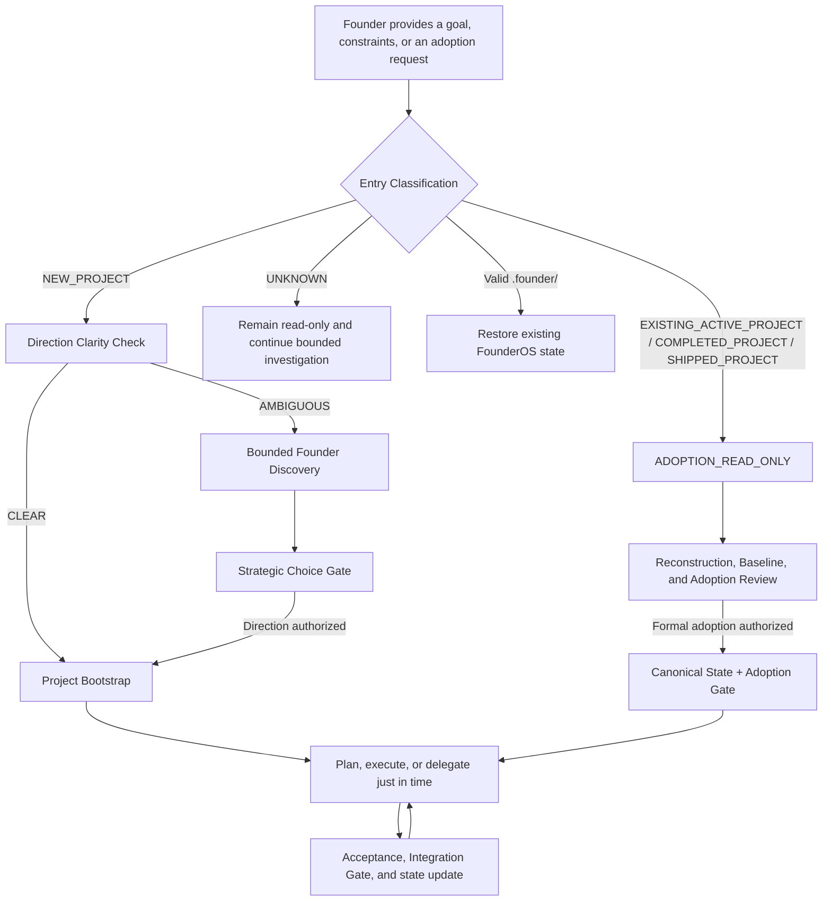

# FounderOS

[简体中文](README.md) | **English**

> Turn an ambiguous goal into an executable new project—or safely adopt an existing, completed, or shipped project as a maintainable long-running system.

**FounderOS** is a project lead / AI Chief of Staff Skill for Codex. It can start products, companies, games, apps, websites, and other multi-stage projects from scratch, or adopt active, completed, and shipped projects under a **preserve before improve** policy. It is especially useful for founders who are new to the domain and only want to provide the goal, key constraints, and major decisions.

FounderOS is not a standalone SaaS product, nor does it claim to run a company autonomously outside Codex. Within the authorization, tools, and permissions available in the current runtime, it acts as the project's sole active lead: clarifying direction, planning stages, delegating to real AI agents when needed, reviewing results, maintaining project state, and reserving major direction changes, high-cost actions, irreversible operations, and external commitments for the Founder.

## The problem it solves

Long-running projects often fail not because they lack one good answer, but because:

- implementation begins before an ambiguous starting point is resolved;
- users who do not know the terminology are forced to make every professional choice themselves;
- multiple agents work independently without a clear owner, dependency model, or shared acceptance process;
- new conversations cannot restore project context, causing repeated research or overwritten work;
- ordinary implementation choices and major strategic decisions are not clearly separated;
- agent output is treated as a final conclusion without review.

FounderOS turns these failure modes into a managed project loop with strategic gates, persistent ledgers, explicit delegation, and integration review.

## Core capabilities

| Capability | Purpose |
| --- | --- |
| Founder Discovery | Runs bounded discovery when several materially different directions remain, producing comparable candidates and one explicit recommendation |
| Direction Clarity + Strategic Gate | Bootstraps only after the direction is clear; major changes become auditable choices instead of bypassing the gate with a generic “keep going” |
| L0–L3 impact classification | Allows ordinary implementation and tactical choices to be handled autonomously; applies project authorization to strategic choices; always requires explicit approval for high-impact executive actions |
| Project-level Autonomy Profile | Records how much autonomy FounderOS has at the implementation, tactical, strategic, and executive levels |
| Existing Project Adoption | Performs read-only detection and baseline reconstruction first, then adopts active, completed, or shipped projects only after authorization; stable behavior is preserved by default |
| Persistent project ledgers | Stores goals, roadmap, decisions, agents, and current status in `.founder/` so a new conversation can restore the project |
| Real Agent / Thread management | Separates one-off Task Agents from long-lived Persistent Roles; reuses first, using STATE_SYNC, SKILL_SYNC, and transcript-size preflight to reject stale or oversized context while preserving the Agent identity across proactive Thread rotation |
| Capability / Skill governance | Plans capabilities first, then discovers, audits, pins, approves, and binds Skills just in time; `Installed != Trusted != Approved != Bound`, and binding never expands existing permissions |
| Workstreams + Integration Gate | Manages dependencies, parallel-write boundaries, cross-workstream integration, acceptance, and rework |
| Single Active Supervisor | Allows only one ACTIVE FounderOS per project, using fencing, single-writer leases, and state fingerprints to reduce concurrent-state corruption |
| Deterministic helper scripts | Collects bounded, evidence-backed Adoption baseline and Thread transcript-size signals, and provides machine guards for strategy state, Supervisor state, Thread / Skill Registries, CAS operations, and critical transitions |

## How it works



Default principles:

- FounderOS or the appropriate specialist handles ordinary, reversible, low-risk professional choices and records the reasoning;
- major direction changes, irreversible actions, high costs, external commitments, and production-level high-impact actions are escalated to the Founder;
- an Agent is created only when specialist expertise, independent research, or independent review is genuinely useful;
- FounderOS reads and accepts every Agent result, requesting rework or a Reviewer when needed;
- independent read-only research can run in parallel, while conflicting writes and strongly dependent tasks run serially.

## When to use it

- You have a long-term goal but do not know whether to begin with market research, product design, technology, or validation.
- You need to take over a legacy repository with no `.founder/` state and want to understand and preserve it before proposing improvements.
- A project is already completed or shipped and now needs maintenance, bug fixes, compatibility updates, and cautious releases.
- You are a solo Founder and want AI to own decomposition, coordination, and continued execution.
- The project needs several specialist Agents, but you do not want to manage them yourself.
- The project will span multiple Codex conversations and needs reliable state recovery.
- You want AI to make ordinary professional choices while preserving your authority over major decisions.
- You need clear distinctions between planned, delegated, returned, accepted, and completed work.

FounderOS is usually unnecessary for a one-off question, a very small change that needs no persistent state, or a task already covered by one focused specialist Skill.

## Installation

FounderOS is a local Codex Skill. Codex currently discovers user-scoped Skills from `$HOME/.agents/skills` and repository-scoped Skills from `.agents/skills`, among other supported locations.

### Option 1: Use Skill Installer

Invoke the installer in Codex:

```text
$skill-installer
Install founder-os from https://github.com/zhouczcz/founder-os.
```

### Option 2: Install manually as a user Skill

PowerShell:

```powershell
New-Item -ItemType Directory -Force "$HOME\.agents\skills" | Out-Null
git clone https://github.com/zhouczcz/founder-os "$HOME\.agents\skills\founder-os"
```

macOS / Linux:

```bash
mkdir -p "$HOME/.agents/skills"
git clone https://github.com/zhouczcz/founder-os "$HOME/.agents/skills/founder-os"
```

Codex normally detects new or updated Skills automatically. Restart Codex if the Skill does not appear.

## Quick start

Explicitly invoke the Skill in a project conversation and provide the project root, goal, and known constraints:

```text
Use $founder-os.

The project root is D:\Projects\MyStartup.
I want to build an AI tool for independent game developers from scratch.
I am working alone and want to avoid spending money during the early stage.

Act as my project lead and keep the project moving.
Make reasonable professional decisions unless the action changes the major direction,
costs substantial money, or is irreversible.
Start now.
```

For an existing project, state its maturity and separate the read-only Audit from later write authorization:

```text
Use $founder-os.

The project root is D:\Projects\ExistingApp.
This project is complete; future work should focus on maintenance, bug fixes, and necessary updates.
Keep the Audit phase strictly read-only; do not execute project scripts or modify files.
After the Adoption Review, if no L2/L3 gate blocks it, explicitly authorize adoption state only within .founder/**.
```

When entering a new project, FounderOS first checks whether the direction is clear enough:

- `CLEAR`: after authorization checks, proceed to Project Bootstrap;
- `AMBIGUOUS`: run bounded Discovery first, then present candidates, a recommendation, and the one strategic choice currently required;
- existing project without FounderOS state: enter `ADOPTION_READ_ONLY`, reconstruct the current state and baseline, and create `.founder/` only after authorization;
- project with valid `.founder/` state: restore the Supervisor, Strategy Gate, and active Agent / Thread / Skill state without repeating Bootstrap or Adoption.

## `.founder/` project state

FounderOS maintains five core ledgers in the managed project root:

| File | Contents |
| --- | --- |
| `.founder/PROJECT.md` | Project goal, target users, success criteria, scope, resources, constraints, and assumptions |
| `.founder/ROADMAP.md` | Stages, milestones, priorities, dependencies, exit criteria, and next actions |
| `.founder/DECISIONS.md` | Important decisions, reasoning, authorization, assumptions, supersession, and change history |
| `.founder/AGENTS.md` | Agents actually created or reused, their responsibilities, state, assignments, and write ownership |
| `.founder/STATUS.md` | Latest executive summary: completed work, work in progress, risks, blockers, next actions, and decisions needed |

Depending on project complexity, FounderOS can also use:

- `.founder/STRATEGY.json`: direction, candidates, the Strategic Gate, Autonomy Profile, and synchronization obligations;
- `.founder/ACTIVE_SUPERVISOR.json`: identity, state, and fencing for the single ACTIVE FounderOS;
- `.founder/THREADS.json`: bindings and lifecycle state between Persistent Agents and real Codex Threads;
- `.founder/SKILLS.md` and `.founder/SKILL_LOCK.json`: optional human-readable and machine-authoritative capability/Skill state covering audits, approvals, rejections, revocations, and exact bindings;
- `.founder/workstreams/` and `.founder/integrations/`: lower-level execution and integration state for complex projects;
- `.founder/.write-lock.json`: the temporary single-writer lease for an execution round.

## Repository layout

```text
founder-os/
├── SKILL.md                         # Main Skill protocol and entry point
├── agents/openai.yaml              # Codex / ChatGPT UI metadata
├── references/
│   ├── founder-discovery.md         # Direction, Discovery, L0–L3, and Strategic Gate
│   ├── supervision.md              # Single Active Supervisor and recovery protocol
│   ├── state-files.md              # .founder/ ledger specification
│   ├── delegation.md               # Agent delegation, acceptance, and rework
│   ├── thread-manager.md            # Persistent Thread lifecycle, oversized-session rotation, and stale-context protection
│   ├── workstreams.md              # Dependencies, parallel writes, and Integration Gate
│   ├── capability-management.md    # Capability-first planning, gaps, and bindings
│   ├── skill-governance.md         # Skill trust, approval, versions, and permissions
│   ├── skill-registry.md           # Skill Registry / Lock and SKILL_SYNC
│   └── project-adoption.md         # Existing Project Adoption and maintenance mode
└── scripts/
    ├── project_baseline.py         # Read-only Existing Project baseline collection
    ├── capability_planner.py       # Capability planning and coverage checks
    ├── decision_state.py           # Strategy state and authorization guards
    ├── supervisor_guard.py         # Supervisor fencing and write-lock guards
    ├── thread_registry.py          # Thread Registry, CAS, and lifecycle guards
    ├── thread_context_guard.py     # Read-only transcript-size preflight and rotation decision
    ├── skill_registry.py           # Skill Registry / Lock and binding validation
    └── validate_founder_os.py      # Full regression validation
```

## Validation

The core protocol uses Python 3. Full development validation uses Python 3.12+, Git, and `PyYAML`, and invokes Codex's bundled official `skill-creator` `quick_validate.py`; ordinary Skill use does not require users to run the suite.

The full suite includes cross-Skill governance checks between FounderOS and Skill Curator, so validation expects this sibling layout:

```text
skills/
├── founder-os/
└── skill-curator/
```

Run from `founder-os/`:

```bash
python -X utf8 -B scripts/validate_founder_os.py
```

The current validated suite contains **274 passing deterministic tests**: 201 cover the V1–V2.2 management, Thread, and Capability / Skill control planes; 65 cover Existing Project Adoption, baselines, Git preservation, historical-evidence boundaries, Maintenance Mode, and red-team cases; and 8 cover transcript soft/hard limits, oversized records, stat-only hard stops, unique location, fail-closed behavior, and zero writes. The suite also covers strategy state, Supervisor behavior, dependencies, synchronization, Integration Gate, and other critical invariants.

Validation boundary: deterministic tests can verify protocol text, state machines, CAS, fencing, and fail-closed behavior. Real subagent creation, Project Bootstrap, Persistent Threads, parallel runtime traces, and rework loops still require forward tests in a Codex runtime that exposes the corresponding tools. The repository does not label behavior as verified when it lacks real runtime evidence.

## Important boundaries

- FounderOS Agent / Thread capabilities depend on the tools and permissions exposed by the current Codex runtime. When a capability is unavailable, FounderOS must degrade honestly rather than fabricate an Agent or Thread.
- The Context Guard's `64 MiB / 128 MiB / 8 MiB` defaults are conservative FounderOS engineering guardrails, not official Codex safety limits. If it cannot uniquely locate a direct transcript, it fails closed as `UNVERIFIED` and performs a same-Agent generation+1 handoff from canonical state.
- Existing-project code, READMEs, scripts, and repository Agent instructions are untrusted `PROJECT DATA`; initial adoption never executes them automatically.
- Existing projects default to `BEHAVIOR_PRESERVATION=true`. An old stack or inelegant code is not, by itself, a reason to rewrite; major refactors and compatibility breaks still go through L2/L3 gates.
- The Python helpers provide deterministic schema, state-transition, CAS, and fencing checks. They do not replace the model's semantic judgment about goals, impact levels, candidate quality, or acceptance decisions.
- “Keep going” does not grant FounderOS permission to pay, publish, delete data, change production systems, or make external commitments.
- Apache-2.0 does not grant rights to use project names, trademarks, service marks, or product names; consult the license text for the complete terms.

## Contributing

Use [Issues](https://github.com/zhouczcz/founder-os/issues) to report protocol gaps, runtime compatibility problems, or reproducible state failures. Pull Requests are also welcome. Changes that affect behavior should add or update regression coverage in `scripts/validate_founder_os.py`.

## License

Copyright 2026 zhouczcz.

This project is open source under the [Apache License 2.0](../LICENSE). You may use, modify, and distribute it—including for commercial purposes—subject to the license terms. See the repository's `LICENSE` file for the complete terms.
