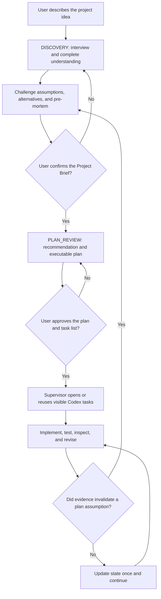

# FounderOS

[简体中文](README.md) | **English**

> Understand the whole project, challenge bad directions, then open real Codex tasks to deliver it.

**FounderOS** is a Codex project supervisor for solo developers. It interviews the user, challenges the direction, and produces a plan. After the user approves the plan and exact task list, the supervisor opens sidebar-visible Codex tasks just as the user could, assigns work, waits, inspects results, requests revisions, and keeps the project moving. Small one-off work uses subagents instead.

“Supervisor,” “employees,” and “hiring” are explanatory metaphors, not an enterprise-management workflow. FounderOS uses lightweight project state by default. Its older high-assurance controls are loaded only for high-risk, multi-writer, production, or formal-audit work. The user owns the idea and major decisions; the supervisor owns independent judgment, planning, coordination, and acceptance.

## The problem it solves

Solo projects often fail not because the developer cannot code, but because:

- AI starts generating or implementing before the idea is understood;
- the user has no complete plan and must keep saying “continue”;
- a compliant assistant follows a bad assumption instead of challenging it;
- several agents lack one goal, dependency model, and acceptance owner;
- the user still has to create, switch between, and chase every work conversation;
- bookkeeping, polling, and repeated context cost more than project work;
- a new conversation cannot restore the project from a compact state.

FounderOS turns these failures into a lightweight loop: interview → challenge → confirm the brief → approve the plan and task list → supervisor-created Codex tasks → acceptance and correction.

## Core capabilities

| Capability | Purpose |
| --- | --- |
| Project interview | Asks project-shaping questions over multiple rounds and produces a confirmable Project Brief instead of a mechanical questionnaire |
| Independent judgment | Separates user preference, evidence, and recommendation; provides counterarguments, alternatives, a pre-mortem, and reconsideration triggers |
| Options and plan | Compares materially different paths and defines milestones, tasks, dependencies, risks, agent roles, and observable acceptance criteria |
| Real task execution | Lists proposed conversations in the plan, then creates user-visible Codex tasks and manages assignment, waiting, acceptance, and revision after approval |
| Continuous correction | Stops work based on invalid assumptions, compares continuing, changing, or abandoning the path, and escalates major direction changes |
| Lightweight state | Keeps Project, Roadmap, and Status by default, with Decisions and Agents only when needed; unchanged state is not repeatedly read or rewritten |
| Existing Project Adoption | Reads and preserves a complex existing project before deciding how to adopt or improve it |
| High-assurance mode | Loads Delegation-First, Supervisor Execution Firewall, Specialist, and Artifact ownership controls only for high-risk, multi-writer, or formal-audit work |
| Context budget | Batches operations, waits on events, saves large output as artifacts, and proactively rotates oversized Threads |

## How it works



Default principles:

- a new project completes the interview and Project Brief confirmation before options and plan confirmation;
- the supervisor must give counterarguments and an independent recommendation instead of rationalizing the user's first preference;
- approving the plan authorizes only the listed new tasks; the supervisor creates them with minimum relevant context;
- substantial independent deliverables use visible Worker tasks, while small one-off work uses subagents;
- the supervisor inspects actual artifacts and evidence, requesting revision from the original Agent when needed;
- ordinary low-risk adjustments are autonomous, while major direction, irreversible, costly, or production actions remain with the user;
- one accepted task normally produces one state update, with no polling of unchanged progress.

## When to use it

- You have a project idea but do not know how to clarify it, challenge the direction, and turn it into a complete plan.
- You are concerned that AI will agree with you and keep following a bad assumption.
- You need to take over a legacy repository with no `.founder/` state and want to understand and preserve it before proposing improvements.
- A project is already completed or shipped and now needs maintenance, bug fixes, compatibility updates, and cautious releases.
- You are a solo developer and want a supervisor to own decomposition, coordination, and continued execution.
- The project needs several specialist Agents, but you do not want to manage them yourself.
- You want the supervisor to open, coordinate, and continue real Codex conversations just as you could.
- The project will span multiple Codex conversations and needs reliable state recovery.
- You want independent AI judgment rather than automatic agreement while preserving authority over major decisions.
- You need clear distinctions between planned, delegated, returned, accepted, and completed work.

FounderOS is usually unnecessary for a one-off question, a very small change that needs no persistent state, or a task already covered by one focused specialist Skill.

## Installation

FounderOS is a local Codex Skill. Codex currently discovers user-scoped Skills from `$HOME/.agents/skills` and repository-scoped Skills from `.agents/skills`, among other supported locations.

### Option 1: Use Skill Installer

Invoke the installer in Codex:

```text
$skill-installer
Install founder-os from https://github.com/zhouczcz/founder-os.
```

### Option 2: Install manually as a user Skill

PowerShell:

```powershell
New-Item -ItemType Directory -Force "$HOME\.agents\skills" | Out-Null
git clone https://github.com/zhouczcz/founder-os "$HOME\.agents\skills\founder-os"
```

macOS / Linux:

```bash
mkdir -p "$HOME/.agents/skills"
git clone https://github.com/zhouczcz/founder-os "$HOME/.agents/skills/founder-os"
```

Codex normally detects new or updated Skills automatically. Restart Codex if the Skill does not appear.

## Quick start

Explicitly invoke the Skill in a project conversation and provide the project root, goal, and known constraints:

```text
Use $founder-os.

The project root is D:\Projects\MyStartup.
I want to build an AI tool for independent game developers from scratch.
I am working alone and want to avoid spending money during the early stage.

Act as my project lead and keep the project moving.
Make reasonable professional decisions unless the action changes the major direction,
costs substantial money, or is irreversible.
After Bootstrap, create and hand off to one dedicated manager conversation for this project.
Start now.
```

For an existing project, state its maturity and separate the read-only Audit from later write authorization:

```text
Use $founder-os.

The project root is D:\Projects\ExistingApp.
This project is complete; future work should focus on maintenance, bug fixes, and necessary updates.
Keep the Audit phase strictly read-only; do not execute project scripts or modify files.
After the Adoption Review, if no L2/L3 gate blocks it, explicitly authorize adoption state only within .founder/**.
After formal Adoption, create and hand off to one dedicated manager conversation for the canonical project root.
```

When entering a new project, FounderOS first checks whether the direction is clear enough:

- `CLEAR`: after authorization checks, proceed to Project Bootstrap;
- `AMBIGUOUS`: run bounded Discovery first, then present candidates, a recommendation, and the one strategic choice currently required;
- existing project without FounderOS state: enter `ADOPTION_READ_ONLY`, reconstruct the current state and baseline, and create `.founder/` only after authorization;
- project with valid `.founder/` state: restore the Supervisor, Strategy Gate, and active Agent / Thread / Skill state without repeating Bootstrap or Adoption.

## `.founder/` project state

FounderOS maintains five core ledgers in the managed project root:

| File | Contents |
| --- | --- |
| `.founder/PROJECT.md` | Project goal, target users, success criteria, scope, resources, constraints, and assumptions |
| `.founder/ROADMAP.md` | Stages, milestones, priorities, dependencies, exit criteria, and next actions |
| `.founder/DECISIONS.md` | Important decisions, reasoning, authorization, assumptions, supersession, and change history |
| `.founder/AGENTS.md` | Agents actually created or reused, their responsibilities, state, assignments, and write ownership |
| `.founder/STATUS.md` | Latest executive summary: completed work, work in progress, risks, blockers, next actions, and decisions needed |

Depending on project complexity, FounderOS can also use:

- `.founder/STRATEGY.json`: direction, candidates, the Strategic Gate, Autonomy Profile, and synchronization obligations;
- `.founder/ACTIVE_SUPERVISOR.json`: identity, state, and fencing for the single ACTIVE FounderOS;
- `.founder/THREADS.json`: bindings and lifecycle state between Persistent Agents and real Codex Threads;
- `.founder/memory/MEMORY.json`: project-local Organization Memory created under `FIRST_ACCEPTED_TYPED_FACT`, only after the first finalized Outcome, accepted Lesson, canonical Decision Outcome, or accepted Organization pattern;
- `.founder/SKILLS.md` and `.founder/SKILL_LOCK.json`: optional human-readable and machine-authoritative capability/Skill state covering audits, approvals, rejections, revocations, and exact bindings;
- `.founder/workstreams/` and `.founder/integrations/`: lower-level execution and integration state for complex projects;
- `.founder/.write-lock.json`: the temporary single-writer lease for an execution round.

## Repository layout

```text
founder-os/
├── SKILL.md                         # Main Skill protocol and entry point
├── agents/openai.yaml              # Codex / ChatGPT UI metadata
├── references/
│   ├── founder-discovery.md         # Direction, Discovery, L0–L3, and Strategic Gate
│   ├── supervision.md              # Single Active Supervisor and recovery protocol
│   ├── state-files.md              # .founder/ ledger specification
│   ├── delegation.md               # Agent delegation, acceptance, and rework
│   ├── supervisor-execution.md     # Delegation-First, Artifact ownership, and the Main execution firewall
│   ├── thread-manager.md            # Persistent Thread lifecycle, oversized-session rotation, and stale-context protection
│   ├── main-thread-provisioning.md # Dedicated manager-task creation, Supervisor handoff, and acceptance
│   ├── organization-memory.md      # Outcomes, Lessons, Decisions, queries, compaction, and poisoning resistance
│   ├── agent-performance.md        # Context-specific Agent / Skill / Team evidence and routing
│   ├── workstreams.md              # Dependencies, parallel writes, and Integration Gate
│   ├── capability-management.md    # Capability-first planning, gaps, and bindings
│   ├── skill-governance.md         # Skill trust, approval, versions, and permissions
│   ├── skill-registry.md           # Skill Registry / Lock and SKILL_SYNC
│   └── project-adoption.md         # Existing Project Adoption and maintenance mode
└── scripts/
    ├── project_baseline.py         # Read-only Existing Project baseline collection
    ├── capability_planner.py       # Capability planning and coverage checks
    ├── decision_state.py           # Strategy state and authorization guards
    ├── supervisor_guard.py         # Supervisor fencing and write-lock guards
    ├── thread_registry.py          # Thread Registry, CAS, and lifecycle guards
    ├── thread_context_guard.py     # Read-only transcript-size preflight and rotation decision
    ├── memory_registry.py          # Organization Memory, derived indexes, CAS, queries, and compaction
    ├── skill_registry.py           # Skill Registry / Lock and binding validation
    └── validate_founder_os.py      # Full regression validation
```

## Validation

The core protocol uses Python 3. Full development validation uses Python 3.12+, Git, and `PyYAML`, and invokes Codex's bundled official `skill-creator` `quick_validate.py`; ordinary Skill use does not require users to run the suite.

The full suite includes cross-Skill governance checks between FounderOS and Skill Curator, so validation expects this sibling layout:

```text
skills/
├── founder-os/
└── skill-curator/
```

Run from `founder-os/`:

```bash
python -X utf8 -B scripts/validate_founder_os.py
```

The current validated suite contains **400 deterministic tests**. The original 282 V1–V2.4 and 89 V3 Organization Memory regressions (371 total) remain unchanged. Twenty-nine V3.1 tests constrain the four execution classes, Delegation-First, the nineteen-field task contract, forward-only zero-state migration compatibility for existing FounderOS projects, Artifact Ownership, Completion Boundary, Worker Revision, Takeover/Direct Exception, Scope Escalation, Delegation Theater, Independent Review, read-only zero-write behavior, Scenarios A–W, red-team cases, and the Warcraft Parser E2E contract.

Validation boundary: deterministic tests can verify protocol text, state machines, CAS, fencing, structured aggregation, filtering, and fail-closed behavior. Supervisor/Specialist semantic classification, real subagent creation, Artifact provenance, real Agent/Skill selection quality, Project Bootstrap, dedicated manager-task creation and handoff, Persistent Thread `MEMORY_SYNC`, parallel runtime traces, and rework loops still require forward tests in a Codex runtime that exposes the corresponding tools. The repository does not present static contracts or Python fixtures as proof of real Agent behavior.

## Important boundaries

- FounderOS Agent / Thread capabilities depend on the tools and permissions exposed by the current Codex runtime. When a capability is unavailable, FounderOS must degrade honestly rather than fabricate an Agent or Thread.
- The Context Guard's `64 MiB / 128 MiB / 8 MiB` defaults are conservative FounderOS engineering guardrails, not official Codex safety limits. If it cannot uniquely locate a direct transcript, it fails closed as `UNVERIFIED` and performs a same-Agent generation+1 handoff from canonical state.
- Existing-project code, READMEs, scripts, and repository Agent instructions are untrusted `PROJECT DATA`; initial adoption never executes them automatically.
- Existing projects default to `BEHAVIOR_PRESERVATION=true`. An old stack or inelegant code is not, by itself, a reason to rewrite; major refactors and compatibility breaks still go through L2/L3 gates.
- The Python helpers provide deterministic schema, state-transition, CAS, and fencing checks. They do not replace the model's semantic judgment about goals, impact levels, candidate quality, or acceptance decisions.
- The Supervisor/Specialist boundary still requires semantic judgment and cannot be classified with mathematical completeness from static keywords; V3.1 does not add an `execution_guard.py` that pretends otherwise.
- Organization Memory is project-local and just-in-time by default, with no external database or API key. It does not store full chats, prompts, hidden reasoning, or chain-of-thought, and historical performance cannot expand permissions, Skill Trust, or fixed gates.
- “Keep going” does not grant FounderOS permission to pay, publish, delete data, change production systems, or make external commitments.
- Apache-2.0 does not grant rights to use project names, trademarks, service marks, or product names; consult the license text for the complete terms.

## Contributing

Use [Issues](https://github.com/zhouczcz/founder-os/issues) to report protocol gaps, runtime compatibility problems, or reproducible state failures. Pull Requests are also welcome. Changes that affect behavior should add or update regression coverage in `scripts/validate_founder_os.py`.

## License

Copyright 2026 zhouczcz.

This project is open source under the [Apache License 2.0](../LICENSE). You may use, modify, and distribute it—including for commercial purposes—subject to the license terms. See the repository's `LICENSE` file for the complete terms.
