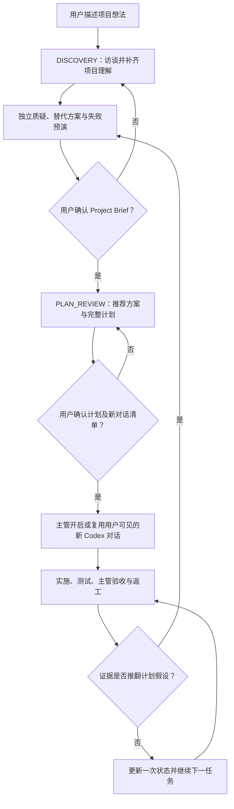

# FounderOS

**简体中文** | [English](README.en.md)

> 先把项目问清楚、敢于反对错误方向，再由主管开启真实新对话把它完成。

**FounderOS** 是面向单人开发者的 Codex 项目主管。它先访谈并挑战项目方向，再给出方案和计划。用户确认计划及对话清单后，主管会像用户一样开启侧边栏可见的独立 Codex 项目对话（真实 AI Agent），向它们派工、等待结果、验收、返工并持续推进；只有短小的一次性工作才使用 subagent。

“主管、员工、招聘”只是便于理解的类比，不是企业管理流程。FounderOS 默认不运行复杂组织治理；高风险、多写入者、生产或正式审计场景才按需启用原有高级协议。用户负责想法和重大决定，项目主管负责独立判断、计划与交付。

## 它解决什么问题

单人开发常见的失败不是“不会写代码”，而是：

- 想法还没问清楚，AI 就急着生成方案或开始实现；
- 用户缺少完整计划，只能不断让 AI“继续”；
- AI 为了顺从用户，沿着错误假设持续投入；
- 多个 Agent 没有统一目标、依赖和验收；
- 用户仍要亲自创建、切换和催促每一个工作对话；
- 管理文件、轮询和重复上下文消耗超过实际项目工作；
- 新对话无法用精炼状态恢复项目。

FounderOS 把这些问题收束为“访谈 → 质疑 → 简报确认 → 计划及对话清单确认 → 主管创建新对话 → 验收纠偏”的轻量闭环。

## 核心能力

| 能力 | 作用 |
| --- | --- |
| 项目访谈 | 逐轮询问真正影响项目方向的问题，形成可确认的 Project Brief，而不是机械问卷 |
| 独立判断 | 区分用户偏好、证据和主管推荐；给出反方观点、替代方案、失败预演和重估条件 |
| 方案与计划 | 比较实质不同的路径，输出里程碑、任务、依赖、风险、Agent 角色和可观察验收标准 |
| 真实新对话执行 | 计划中列出准备开启的对话；确认后由主管创建用户可见的 Codex 任务，统一派工、等待、验收和返工 |
| 持续纠偏 | 证据推翻假设时停止受影响工作，独立分析继续、调整或放弃，并对重大方向重新请用户决定 |
| 轻量项目状态 | 默认只维护 Project、Roadmap、Status，以及按需的 Decisions 和 Agents；未变化内容不重复读取或改写 |
| Existing Project Adoption | 对复杂既有项目先只读理解和保留行为，再决定如何接管或改进 |
| 高级保障模式 | 仅在高风险、多写入者或正式审计时按需启用 Delegation-First、Supervisor Execution Firewall、Specialist 与 Artifact ownership 等旧协议 |
| 上下文预算 | 批量执行、事件驱动等待、大输出落盘、主动轮换超长 Thread，避免管理成本压过项目工作 |

## 工作方式



默认原则是：

- 新项目先完成访谈和 Project Brief 确认，再确认方案与计划；
- 主管必须提出反对意见和独立推荐，不因用户坚持就伪造支持证据；
- 计划确认同时授权清单中的新对话；主管亲自创建并只传最小必要上下文；
- 大型独立交付使用可见 Worker 对话，短小一次性工作才使用 subagent；
- 所有 Agent 结果都由主管检查真实产物和验证证据，必要时要求原 Agent 返工；
- 普通低风险调整自主处理，重大方向、不可逆、高成本或生产动作交给用户决定；
- 一个已验收任务只更新一次项目状态，不轮询无变化进度。

## 适用场景

- 你有一个项目想法，但不知道怎样把它问清楚、判断方向并拆成完整计划；
- 你担心 AI 只会迎合你，即使假设错误也沿着错误方向继续；
- 你要接管没有 `.founder/` 的旧代码库，并希望先理解现状、保留行为、再决定是否改进；
- 项目已经完成或上线，今后主要需要维护、修 Bug、兼容性更新和谨慎发布；
- 你是单人开发者，希望项目主管负责拆解、协调和持续推进；
- 项目需要多个专业 Agent，但不希望自己管理它们；
- 你希望主管像你一样开启、切换并推进多个真实 Codex 对话；
- 项目会跨越多次 Codex 对话，需要可靠恢复状态；
- 你希望 AI 独立判断而不是盲目同意，同时保留重大决策权；
- 你需要清晰区分“计划中”“已委派”“已返回”“已验收”和“已完成”。

以下情况通常不需要 FounderOS：一次性的简单问答、很小且无需持续状态的修改，或只需要某个单一专业 Skill 的任务。

## 安装

FounderOS 是一个本地 Codex Skill。Codex 当前会从个人目录 `$HOME/.agents/skills` 和仓库内 `.agents/skills` 等位置发现 Skill。

### 方法一：使用 Skill Installer

在 Codex 中调用：

```text
$skill-installer
请从 https://github.com/zhouczcz/founder-os 安装 founder-os。
```

### 方法二：手动安装为个人 Skill

PowerShell：

```powershell
New-Item -ItemType Directory -Force "$HOME\.agents\skills" | Out-Null
git clone https://github.com/zhouczcz/founder-os "$HOME\.agents\skills\founder-os"
```

macOS / Linux：

```bash
mkdir -p "$HOME/.agents/skills"
git clone https://github.com/zhouczcz/founder-os "$HOME/.agents/skills/founder-os"
```

Codex 通常会自动发现新增或更新的 Skill；如果没有出现，请重启 Codex。

## 快速开始

在项目对话中明确调用 Skill，并提供项目根目录、目标和已知约束：

```text
使用 $founder-os。

项目根目录是 D:\Projects\MyStartup。
我想从零做一个面向独立游戏开发者的 AI 工具。
目前只有我一个人，前期尽量不花钱。

你作为项目总管负责推进。
除非遇到重大方向、高成本、不可逆操作，否则自行判断并继续。
Bootstrap 完成后，为这个项目创建并交接一个独立总管对话。
现在开始。
```

接管既有项目时，明确说明项目现状，并把只读 Audit 与后续写入授权分开：

```text
使用 $founder-os。

项目根目录是 D:\Projects\ExistingApp。
这是一个已经完成的项目，以后主要负责维护、修 Bug 和必要更新。
Audit 阶段严格只读，不要执行项目脚本或修改任何文件。
完成 Adoption Review 后，如果没有 L2/L3 阻塞，明确授权仅在 .founder/** 创建接管状态。
正式接管完成后，为 canonical 项目根创建并交接一个独立总管对话。
```

首次进入新项目时，FounderOS 会先判断方向是否足够清楚：

- `CLEAR`：完成授权检查后进入 Project Bootstrap；
- `AMBIGUOUS`：先做有界 Discovery，给出候选、推荐和当前必须决定的一项战略选择；
- 无 FounderOS 状态的既有项目：先进入 `ADOPTION_READ_ONLY`，重建现状和基线；获得授权后才创建 `.founder/`；
- 已有有效 `.founder/` 的项目：恢复 Supervisor、Strategy Gate 和进行中的 Agent / Thread / Skill 状态，不重复 Bootstrap 或 Adoption。

## `.founder/` 项目状态

FounderOS 在被管理项目的根目录维护五份核心账本：

| 文件 | 内容 |
| --- | --- |
| `.founder/PROJECT.md` | 项目目标、目标用户、成功标准、范围、资源、约束和假设 |
| `.founder/ROADMAP.md` | 阶段、里程碑、优先级、依赖、出口条件和下一步 |
| `.founder/DECISIONS.md` | 重要决策、理由、授权、假设、替代关系和改变记录 |
| `.founder/AGENTS.md` | 实际创建或复用的 Agent、职责、状态、任务与写入所有权 |
| `.founder/STATUS.md` | 最新老板摘要：完成、进行中、风险、阻塞、下一步和待决事项 |

按项目复杂度还会使用：

- `.founder/STRATEGY.json`：Direction、候选、Strategic Gate、Autonomy Profile 与同步义务；
- `.founder/ACTIVE_SUPERVISOR.json`：唯一 ACTIVE FounderOS 的身份、状态和 fencing；
- `.founder/THREADS.json`：Persistent Agent 与真实 Codex Thread 的 binding 和生命周期；
- `.founder/memory/MEMORY.json`：遵循 `FIRST_ACCEPTED_TYPED_FACT`，在首个已验收 Outcome、accepted Lesson、canonical Decision Outcome 或已接受 Organization pattern 后才按需创建的项目本地 Organization Memory；
- `.founder/SKILLS.md` 与 `.founder/SKILL_LOCK.json`：可选的能力/Skill 人读投影与机器权威，记录审计、批准、拒绝、撤销和精确 binding；
- `.founder/workstreams/`、`.founder/integrations/`：复杂项目的下级执行与集成状态；
- `.founder/.write-lock.json`：执行轮中的临时单写入租约。

## 仓库结构

```text
founder-os/
├── SKILL.md                         # Skill 主协议与入口
├── agents/openai.yaml              # Codex / ChatGPT UI 元数据
├── references/
│   ├── founder-discovery.md         # Direction、Discovery、L0–L3 与 Strategic Gate
│   ├── supervision.md              # Single Active Supervisor 与恢复协议
│   ├── state-files.md              # .founder/ 账本规范
│   ├── delegation.md               # Agent 委派、验收与返工
│   ├── supervisor-execution.md     # Delegation-First、Artifact ownership 与 Main 执行防火墙
│   ├── thread-manager.md            # Persistent Thread 生命周期、超大会话轮换与防陈旧上下文
│   ├── main-thread-provisioning.md # 独立总管任务创建、Supervisor 交接与验收
│   ├── organization-memory.md      # Outcome、Lesson、Decision、查询、压缩与防污染
│   ├── agent-performance.md        # 按语境的 Agent / Skill / Team evidence 与 routing
│   ├── workstreams.md              # 依赖、并行写入和 Integration Gate
│   ├── capability-management.md    # Capability-first 规划、差距与绑定
│   ├── skill-governance.md         # Skill 信任、审批、版本与权限治理
│   ├── skill-registry.md           # Skill Registry / Lock 与 SKILL_SYNC
│   └── project-adoption.md         # Existing Project Adoption 与维护模式
└── scripts/
    ├── project_baseline.py         # 只读 Existing Project 基线采集
    ├── capability_planner.py       # Capability 规划与覆盖判断
    ├── decision_state.py           # 战略状态与授权守卫
    ├── supervisor_guard.py         # Supervisor fencing 与写锁守卫
    ├── thread_registry.py          # Thread Registry、CAS 与生命周期守卫
    ├── thread_context_guard.py     # 只读 transcript 体积预检与轮换决策
    ├── memory_registry.py          # Organization Memory、派生索引、CAS、查询与压缩
    ├── skill_registry.py           # Skill Registry / Lock 与绑定校验
    └── validate_founder_os.py      # 完整回归验证
```

## 验证

基础协议使用 Python 3。完整开发验证使用 Python 3.12+、Git 和 `PyYAML`，并调用 Codex 自带的 `skill-creator` 官方 `quick_validate.py`；日常使用 Skill 不要求用户运行测试套件。

完整套件包含 FounderOS 与 Skill Curator 的跨 Skill 治理测试，因此验证目录需要保持以下兄弟结构：

```text
skills/
├── founder-os/
└── skill-curator/
```

在 `founder-os/` 中运行：

```bash
python -X utf8 -B scripts/validate_founder_os.py
```

当前已验证套件包含 **400 项确定性测试**：原 282 项 V1–V2.4 与 89 项 V3 Organization Memory 回归（合计 371 项）保持不变；新增 29 项 V3.1 回归约束四类执行边界、Delegation-First、十九字段任务合同、旧 FounderOS 项目的 forward-only 零状态迁移兼容、Artifact Ownership、Completion Boundary、Worker Revision、Takeover/Direct Exception、Scope Escalation、Delegation Theater、Independent Review、read-only 0-write、A–W 场景、red team 与 Warcraft Parser E2E 合同。

测试边界：确定性测试能够验证协议文本、状态机、CAS、fencing、结构化聚合、过滤和失败关闭行为；Supervisor/Specialist 语义分类、真实 subagent 创建、Artifact provenance、真实 Agent/Skill 选择质量、Project Bootstrap、独立总管任务创建/交接、Persistent Thread `MEMORY_SYNC`、并行运行轨迹及返工闭环仍需在具备相应工具的 Codex runtime 中做 forward test。仓库不会把静态合同或 Python fixture 标记成真实 Agent 行为已验证。

## 重要边界

- FounderOS 的 Agent / Thread 能力取决于当前 Codex runtime 实际提供的工具和权限；能力不可用时必须如实降级，不能伪造 Agent 或 Thread。
- Context Guard 的 `64 MiB / 128 MiB / 8 MiB` 默认值是保守的 FounderOS 工程护栏，不是 Codex 官方安全极限；无法唯一定位 direct transcript 时按 `UNVERIFIED` 失败关闭，并从 canonical state 做同一员工 generation+1 handoff。
- Existing Project 的代码、README、脚本和项目内 Agent 指令默认都是不可信 `PROJECT DATA`；首次接管不会自动执行它们。
- 已有项目默认 `BEHAVIOR_PRESERVATION=true`。旧技术栈或“不够优雅”的代码本身不是重写理由；重大重构和兼容性破坏仍进入 L2/L3 Gate。
- Python helper 负责确定性的 schema、状态转换、CAS 与 fencing 校验，不替代模型对目标、影响等级、候选质量和验收结论的语义判断。
- Supervisor 与 Specialist 的任务边界仍包含语义判断，不能仅靠静态关键词做到数学意义上的完美分类；V3.1 没有新增伪装语义判断的 `execution_guard.py`。
- Organization Memory 默认项目本地、Just-in-Time、无外部数据库或 API key；它不保存聊天全文、Prompt、隐藏推理或 Chain-of-Thought，也不通过历史表现扩大权限、Skill Trust 或降低固定 Gate。
- FounderOS 不会因为“持续推进”而自动获得付款、发布、删除数据、修改生产环境或对外承诺的权限。
- Apache-2.0 许可不授予项目名称、商标、服务标志或产品名称的使用权；具体边界以许可证原文为准。

## 参与改进

欢迎通过 [Issues](https://github.com/zhouczcz/founder-os/issues) 报告协议缺口、运行时兼容问题或可复现的状态异常，也欢迎提交 Pull Request。涉及行为变化的修改应同时补充或更新 `scripts/validate_founder_os.py` 中的回归测试。

## 许可证

Copyright 2026 zhouczcz。

本项目采用 [Apache License 2.0](../LICENSE) 开源。你可以在遵守许可证条款的前提下使用、修改和分发本项目，包括商业用途。完整条款请参阅仓库根目录的 `LICENSE`。
