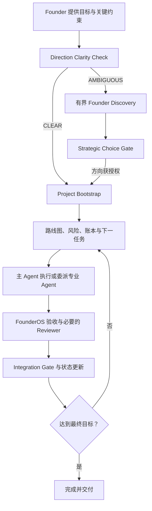

# FounderOS

**简体中文** | [English](README.en.md)

> 把“我想做一个……”变成能够执行、持续推进、恢复上下文并接受验收的长期项目。

**FounderOS** 是一个面向 Codex 的“项目总管 / AI Chief of Staff”Skill。它适合从零启动或接管产品、公司、游戏、App、网站及其他多阶段项目，尤其面向不熟悉目标领域、只希望提供目标、关键约束和重大决策的 Founder。

FounderOS 不是独立 SaaS，也不会承诺脱离 Codex 自动经营公司。它在当前授权和运行时能力内担任唯一项目负责人：澄清方向、规划阶段、按需委派真实 AI Agent、验收结果、维护项目状态，并把重大方向、高成本、不可逆或对外承诺留给 Founder 决定。

## 它解决什么问题

长期项目常见的失败不是“缺少一次回答”，而是：

- 起点模糊，过早进入实现；
- 用户不懂专业术语，却被迫替 AI 做所有专业选择；
- 多个 Agent 各做各的，没有负责人、依赖关系或统一验收；
- 新对话无法恢复项目背景，重复研究或覆盖既有成果；
- 普通实现决策和重大方向决策没有清晰边界；
- Agent 输出未经检查就被当成最终结论。

FounderOS 把这些问题收束为一个带战略门禁、持久账本、明确委派和集成验收的项目运行循环。

## 核心能力

| 能力 | 作用 |
| --- | --- |
| Founder Discovery | 当目标仍存在多个实质方向时，进行有界探索，形成可比较候选和明确推荐 |
| Direction Clarity + Strategic Gate | 方向清楚才 Bootstrap；重大方向变化先形成可审计选择，不用“继续推进”绕过门禁 |
| L0–L3 影响分级 | 普通实现与战术决策可自治；战略选择按项目授权处理；执行级高影响动作始终要求明确批准 |
| 项目级 Autonomy Profile | 记录 FounderOS 在实现、战术、战略和执行层分别拥有多大自主权 |
| 持久项目账本 | 使用 `.founder/` 保存目标、路线图、决策、Agent 与最新状态，让新对话可以恢复项目 |
| 真实 Agent / Thread 管理 | 区分一次性 Task Agent 与长期 Persistent Role；复用优先，不用角色扮演伪造员工 |
| Workstream 与 Integration Gate | 管理依赖、并行写入边界、跨线集成、验收和返工 |
| Single Active Supervisor | 同一项目只允许一个 ACTIVE FounderOS，使用 fencing、写锁和状态指纹降低并发污染风险 |
| 确定性辅助脚本 | 对战略状态、Supervisor、Thread Registry、CAS 和关键状态转换提供机器可验证的守卫 |

## 工作方式



默认原则是：

- 普通、可逆、低风险的专业判断由 FounderOS 或专业 Agent 完成并记录理由；
- 重大方向、不可逆操作、高成本、外部承诺和生产级高影响动作升级给 Founder；
- 需要专业能力、独立研究或独立复核时才创建 Agent；
- 所有 Agent 结果都由 FounderOS 阅读、验收，必要时返工或交给 Reviewer；
- 互相独立的只读研究可以并行，冲突写入和强依赖任务串行推进。

## 适用场景

- 你有一个长期目标，但不知道应先做市场、产品、技术还是验证；
- 你是单人 Founder，希望 AI 负责拆解、协调和持续推进；
- 项目需要多个专业 Agent，但不希望自己管理它们；
- 项目会跨越多次 Codex 对话，需要可靠恢复状态；
- 你希望 AI 对普通专业问题主动判断，同时保留重大决策权；
- 你需要清晰区分“计划中”“已委派”“已返回”“已验收”和“已完成”。

以下情况通常不需要 FounderOS：一次性的简单问答、很小且无需持续状态的修改，或只需要某个单一专业 Skill 的任务。

## 安装

FounderOS 是一个本地 Codex Skill。Codex 当前会从个人目录 `$HOME/.agents/skills` 和仓库内 `.agents/skills` 等位置发现 Skill。

### 方法一：使用 Skill Installer

在 Codex 中调用：

```text
$skill-installer
请从 https://github.com/zhouczcz/founder-os 安装 founder-os。
```

### 方法二：手动安装为个人 Skill

PowerShell：

```powershell
New-Item -ItemType Directory -Force "$HOME\.agents\skills" | Out-Null
git clone https://github.com/zhouczcz/founder-os "$HOME\.agents\skills\founder-os"
```

macOS / Linux：

```bash
mkdir -p "$HOME/.agents/skills"
git clone https://github.com/zhouczcz/founder-os "$HOME/.agents/skills/founder-os"
```

Codex 通常会自动发现新增或更新的 Skill；如果没有出现，请重启 Codex。

## 快速开始

在项目对话中明确调用 Skill，并提供项目根目录、目标和已知约束：

```text
使用 $founder-os。

项目根目录是 D:\Projects\MyStartup。
我想从零做一个面向独立游戏开发者的 AI 工具。
目前只有我一个人，前期尽量不花钱。

你作为项目总管负责推进。
除非遇到重大方向、高成本、不可逆操作，否则自行判断并继续。
现在开始。
```

首次进入新项目时，FounderOS 会先判断方向是否足够清楚：

- `CLEAR`：完成授权检查后进入 Project Bootstrap；
- `AMBIGUOUS`：先做有界 Discovery，给出候选、推荐和当前必须决定的一项战略选择；
- 已有项目：先恢复 `.founder/`、Supervisor、Strategy Gate 和进行中的 Agent / Thread 状态，再继续工作。

## `.founder/` 项目状态

FounderOS 在被管理项目的根目录维护五份核心账本：

| 文件 | 内容 |
| --- | --- |
| `.founder/PROJECT.md` | 项目目标、目标用户、成功标准、范围、资源、约束和假设 |
| `.founder/ROADMAP.md` | 阶段、里程碑、优先级、依赖、出口条件和下一步 |
| `.founder/DECISIONS.md` | 重要决策、理由、授权、假设、替代关系和改变记录 |
| `.founder/AGENTS.md` | 实际创建或复用的 Agent、职责、状态、任务与写入所有权 |
| `.founder/STATUS.md` | 最新老板摘要：完成、进行中、风险、阻塞、下一步和待决事项 |

按项目复杂度还会使用：

- `.founder/STRATEGY.json`：Direction、候选、Strategic Gate、Autonomy Profile 与同步义务；
- `.founder/ACTIVE_SUPERVISOR.json`：唯一 ACTIVE FounderOS 的身份、状态和 fencing；
- `.founder/THREADS.json`：Persistent Agent 与真实 Codex Thread 的 binding 和生命周期；
- `.founder/workstreams/`、`.founder/integrations/`：复杂项目的下级执行与集成状态；
- `.founder/.write-lock.json`：执行轮中的临时单写入租约。

## 仓库结构

```text
founder-os/
├── SKILL.md                         # Skill 主协议与入口
├── agents/openai.yaml              # Codex / ChatGPT UI 元数据
├── references/
│   ├── founder-discovery.md         # Direction、Discovery、L0–L3 与 Strategic Gate
│   ├── supervision.md              # Single Active Supervisor 与恢复协议
│   ├── state-files.md              # .founder/ 账本规范
│   ├── delegation.md               # Agent 委派、验收与返工
│   ├── thread-manager.md            # Persistent Thread 生命周期与防陈旧上下文
│   ├── workstreams.md              # 依赖、并行写入和 Integration Gate
│   └── skill-registry.md           # 可选 Skill Registry 接口
└── scripts/
    ├── decision_state.py           # 战略状态与授权守卫
    ├── supervisor_guard.py         # Supervisor fencing 与写锁守卫
    ├── thread_registry.py          # Thread Registry、CAS 与生命周期守卫
    └── validate_founder_os.py      # 完整回归验证
```

## 验证

需要 Python 3。运行完整验证：

```bash
python -X utf8 -B scripts/validate_founder_os.py
```

V2.1 发布基线包含 **111 项通过的测试**，覆盖静态协议、战略状态、Supervisor、Thread Registry、依赖与 Integration Gate 等关键不变量。

测试边界：确定性测试能够验证协议文本、状态机、CAS、fencing 和失败关闭行为；真实 subagent 创建、Project Bootstrap、Persistent Thread、并行运行轨迹及返工闭环仍需在具备相应工具的 Codex runtime 中做 forward test。仓库不会把缺少真实运行证据的行为标记为已验证。

## 重要边界

- FounderOS 的 Agent / Thread 能力取决于当前 Codex runtime 实际提供的工具和权限；能力不可用时必须如实降级，不能伪造 Agent 或 Thread。
- Python helper 负责确定性的 schema、状态转换、CAS 与 fencing 校验，不替代模型对目标、影响等级、候选质量和验收结论的语义判断。
- FounderOS 不会因为“持续推进”而自动获得付款、发布、删除数据、修改生产环境或对外承诺的权限。
- Apache-2.0 许可不授予项目名称、商标、服务标志或产品名称的使用权；具体边界以许可证原文为准。

## 参与改进

欢迎通过 [Issues](https://github.com/zhouczcz/founder-os/issues) 报告协议缺口、运行时兼容问题或可复现的状态异常，也欢迎提交 Pull Request。涉及行为变化的修改应同时补充或更新 `scripts/validate_founder_os.py` 中的回归测试。

## 许可证

Copyright 2026 zhouczcz。

本项目采用 [Apache License 2.0](../LICENSE) 开源。你可以在遵守许可证条款的前提下使用、修改和分发本项目，包括商业用途。完整条款请参阅仓库根目录的 `LICENSE`。
