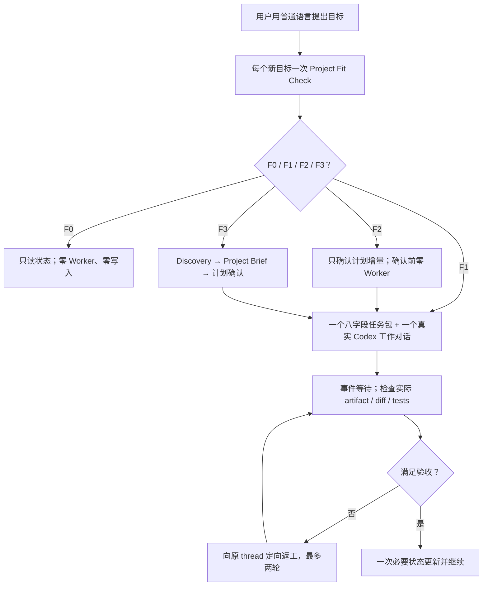

# FounderOS

**简体中文** | [English](README.en.md)

> 用普通语言提目标；长期技术主管结合真实项目质疑、派工、验收并持续推进。

**FounderOS V4.1** 是面向单人开发者、长期存在并了解当前项目的轻量技术主管。它在同一对话处理新项目、功能、Bug、维护和状态问题：结合代码与状态检查适配性，主动挑战错误方向，给出推荐，生成最小任务包，创建或复用真实 Codex 工作对话，再检查产物、diff 和测试证据。

“主管、员工、招聘”只是类比，不是企业管理流程。默认 `V4_LIGHT`：一个逻辑主管、普通任务一个 Worker、无需 Strategy/锁/Registry；`V4_GOVERNED` 只用于明确启用或高风险、多写入者、生产、迁移和正式审计。用户负责目标与重大方向，主管负责独立判断、计划与验收。

## 它解决什么问题

单人开发常见的失败不是“不会写代码”，而是：

- 想法还没问清楚，AI 就急着生成方案或开始实现；
- 用户缺少完整计划，只能不断让 AI“继续”；
- AI 为了顺从用户，沿着错误假设持续投入；
- 多个 Agent 没有统一目标、依赖和验收；
- 用户仍要亲自创建、切换和催促每一个工作对话；
- 管理文件、轮询和重复上下文消耗超过实际项目工作；
- 新对话无法用精炼状态恢复项目。

FounderOS 把这些问题收束为“普通语言请求 → 一次 Fit Check → 必要确认 → 八字段任务包 → 真实 Codex 工作对话 → 事件等待 → 真实产物验收 → 一次状态更新”的轻量闭环。

## 核心能力

| 能力 | 作用 |
| --- | --- |
| 项目访谈 | 逐轮询问真正影响项目方向的问题，形成可确认的 Project Brief，而不是机械问卷 |
| 独立判断 | 区分用户偏好、证据和主管推荐；给出反方观点、替代方案、失败预演和重估条件 |
| 方案与计划 | 比较实质不同的路径，输出里程碑、任务、依赖、风险、Agent 角色和可观察验收标准 |
| 统一请求入口 | 同一主管处理 `PROJECT_IDEA / FEATURE_IDEA / BUG_REPORT / QUESTION_OR_STATUS`；旧维护输入按实际语义归类 |
| 分级 Fit Check | 每个新目标只判断一次 F0–F3；F1 不重做 Discovery，F2 只确认计划增量，F3 才重建 Brief/计划 |
| 真实 Codex 对话 | 默认一个功能/Bug 对应一个真实工作对话和八字段任务包；事件等待、原 thread 最多两轮返工、真实证据验收 |
| 自动消息转发 | 主管调用真实 create/send/wait/read，保存 thread/project/host ID；缺能力时明确 `RUNTIME_THREAD_CAPABILITY_UNAVAILABLE` |
| 侧边栏可见 | 获授权的新 Codex 对话是用户拥有的真实项目任务，不是主管角色扮演出来的 Worker |
| 持续纠偏 | 证据推翻假设时停止受影响工作，独立分析继续、调整或放弃，并对重大方向重新请用户决定 |
| 轻量项目状态 | 使用 Project/Status/唯一 TaskThreads；重大决定才写 Decisions，保存 last indexed commit，未变化不重读改写 |
| Existing Project Adoption | 对复杂既有项目先只读理解和保留行为，再决定如何接管或改进 |
| 高级保障模式 | 仅在高风险、多写入者或正式审计时按需启用 Delegation-First、Supervisor Execution Firewall、Specialist 与 Artifact ownership 等旧协议 |
| 上下文预算 | 批量执行、事件驱动等待、大输出落盘、主动轮换超长 Thread，避免管理成本压过项目工作 |

## 工作方式



默认原则是：

- 新项目先完成访谈、Project Brief 和计划确认；局部功能/Bug 不重新做整套 Discovery；
- 主管必须提出反对意见和独立推荐，不因用户坚持就伪造支持证据；
- 普通任务默认一个真实 Codex 工作对话；首次任务包固定八字段、正文目标 2–4 KiB、禁止递归 Agent；
- F1 请求通过 Fit 后自动创建或复用一个工作对话；重大方案仍在用户确认前零 Worker；
- 计划确认只授权清单中的新工作对话，不授权自动创建新主管；
- 所有 Agent 结果都由主管检查真实产物和验证证据，必要时要求原 Agent 返工；
- 普通低风险调整自主处理，重大方向、不可逆、高成本或生产动作交给用户决定；
- 一个已验收/阻塞任务只更新一次状态；无变化 wait 零模型唤醒、零状态写。

## 适用场景

- 你有一个项目想法，但不知道怎样把它问清楚、判断方向并拆成完整计划；
- 你担心 AI 只会迎合你，即使假设错误也沿着错误方向继续；
- 你要接管没有 `.founder/` 的旧代码库，并希望先理解现状、保留行为、再决定是否改进；
- 项目已经完成或上线，今后主要需要维护、修 Bug、兼容性更新和谨慎发布；
- 你是单人开发者，希望项目主管负责拆解、协调和持续推进；
- 项目需要多个专业 Agent，但不希望自己管理它们；
- 你希望主管像你一样开启、切换并推进多个真实 Codex 对话；
- 项目会跨越多次 Codex 对话，需要可靠恢复状态；
- 你希望 AI 独立判断而不是盲目同意，同时保留重大决策权；
- 你需要清晰区分“计划中”“已委派”“已返回”“已验收”和“已完成”。

以下情况通常不需要 FounderOS：一次性的简单问答、很小且无需持续状态的修改，或只需要某个单一专业 Skill 的任务。

## 安装

FounderOS 是一个本地 Codex Skill。Codex 当前会从个人目录 `$HOME/.agents/skills` 和仓库内 `.agents/skills` 等位置发现 Skill。

### 方法一：使用 Skill Installer

在 Codex 中调用：

```text
$skill-installer
请从 https://github.com/zhouczcz/founder-os 安装 founder-os。
```

### 方法二：手动安装为个人 Skill

PowerShell：

```powershell
New-Item -ItemType Directory -Force "$HOME\.agents\skills" | Out-Null
git clone https://github.com/zhouczcz/founder-os "$HOME\.agents\skills\founder-os"
```

macOS / Linux：

```bash
mkdir -p "$HOME/.agents/skills"
git clone https://github.com/zhouczcz/founder-os "$HOME/.agents/skills/founder-os"
```

Codex 通常会自动发现新增或更新的 Skill；如果没有出现，请重启 Codex。

## 快速开始

在项目对话中明确调用 Skill，并提供项目根目录、目标和已知约束：

```text
使用 $founder-os。

项目根目录是 D:\Projects\MyStartup。
我想从零做一个面向独立游戏开发者的 AI 工具。
目前只有我一个人，前期尽量不花钱。

你作为当前项目的长期轻量技术主管负责推进。
默认使用 V4_LIGHT；除非遇到重大方向、高成本、不可逆或高保障场景，否则自行判断并继续。
不要因为 Bootstrap、Adoption、子项目或 Worker 自动创建另一个主管对话。
现在开始。
```

接管既有项目时，明确说明项目现状，并把只读 Audit 与后续写入授权分开：

```text
使用 $founder-os。

项目根目录是 D:\Projects\ExistingApp。
这是一个已经完成的项目，以后主要负责维护、修 Bug 和必要更新。
Audit 阶段严格只读，不要执行项目脚本或修改任何文件。
完成 Review 后，如果没有重大阻塞，只在必要时复用或创建紧凑 PROJECT/STATUS；真实派工后维护唯一 TASK_THREADS，保留旧文件。
继续使用当前主管对话；只有我明确要求时才创建独立主管任务。
```

每个请求先按 F0–F3 判断：

- `F0_CONTINUATION`：状态/继续/验收，只读必要 STATUS；
- `F1_LOCAL_FIT`：局部功能、普通 Bug、小维护，一个 Worker；
- `F2_PLAN_DELTA`：公共接口、数据、依赖、里程碑或多模块变化，只确认计划增量；
- `F3_PROJECT_RESET`：新项目/根目录/目标用户/核心方向变化，才做完整 Discovery；
- `UNKNOWN`：只问一个真正阻塞的问题。

## `.founder/` 项目状态

`V4_LIGHT` 优先复用三份紧凑索引，并记录 `workflow_profile=V4_LIGHT` 与 `last_indexed_commit`：

| 文件 | 内容 |
| --- | --- |
| `.founder/PROJECT.md` | 项目目标、目标用户、成功标准、范围、资源、约束和假设 |
| `.founder/STATUS.md` | ≤4 KiB 动态索引：HEAD、当前任务、accepted 修改、风险和下一步 |
| `.founder/TASK_THREADS.md` | 唯一任务—对话映射：task/thread/project/host、目标、写入 scope、状态和最后结果 |

`DECISIONS.md` 只在重大决定时使用；LIGHT 不再新建重复的 `AGENTS.md`/`THREADS.json` 映射。`V4_GOVERNED` 或既有高级项目还可使用：

- `.founder/STRATEGY.json`：Direction、候选、Strategic Gate、Autonomy Profile 与同步义务；
- `.founder/ACTIVE_SUPERVISOR.json`：唯一 ACTIVE FounderOS 的身份、状态和 fencing；
- `.founder/THREADS.json`：Persistent Agent 与真实 Codex Thread 的 binding 和生命周期；
- `.founder/memory/MEMORY.json`：遵循 `FIRST_ACCEPTED_TYPED_FACT`，在首个已验收 Outcome、accepted Lesson、canonical Decision Outcome 或已接受 Organization pattern 后才按需创建的项目本地 Organization Memory；
- `.founder/SKILLS.md` 与 `.founder/SKILL_LOCK.json`：可选的能力/Skill 人读投影与机器权威，记录审计、批准、拒绝、撤销和精确 binding；
- `.founder/workstreams/`、`.founder/integrations/`：复杂项目的下级执行与集成状态；
- `.founder/.write-lock.json`：执行轮中的临时单写入租约。

## 仓库结构

```text
founder-os/
├── SKILL.md                         # Skill 主协议与入口
├── agents/openai.yaml              # Codex / ChatGPT UI 元数据
├── references/
│   ├── founder-discovery.md         # Direction、Discovery、L0–L3 与 Strategic Gate
│   ├── lightweight-worker-runtime.md # V4_LIGHT 最小任务包、等待、验收和预算
│   ├── supervision.md              # Single Active Supervisor 与恢复协议
│   ├── state-files.md              # .founder/ 账本规范
│   ├── delegation.md               # Agent 委派、验收与返工
│   ├── supervisor-execution.md     # Delegation-First、Artifact ownership 与 Main 执行防火墙
│   ├── thread-manager.md            # Persistent Thread 生命周期、超大会话轮换与防陈旧上下文
│   ├── main-thread-provisioning.md # 独立总管任务创建、Supervisor 交接与验收
│   ├── organization-memory.md      # Outcome、Lesson、Decision、查询、压缩与防污染
│   ├── agent-performance.md        # 按语境的 Agent / Skill / Team evidence 与 routing
│   ├── workstreams.md              # 依赖、并行写入和 Integration Gate
│   ├── capability-management.md    # Capability-first 规划、差距与绑定
│   ├── skill-governance.md         # Skill 信任、审批、版本与权限治理
│   ├── skill-registry.md           # Skill Registry / Lock 与 SKILL_SYNC
│   ├── legacy-compat.md            # 旧 V4.0 七字段任务包与旧版治理词汇解释
│   └── project-adoption.md         # Existing Project Adoption 与维护模式
└── scripts/
    ├── project_baseline.py         # 只读 Existing Project 基线采集
    ├── capability_planner.py       # Capability 规划与覆盖判断
    ├── lightweight_runtime.py      # F0–F3、任务包、预算和熔断策略引擎（仅供回归套件锁定轻量协议，运行时不调用）
    ├── decision_state.py           # 战略状态与授权守卫
    ├── supervisor_guard.py         # Supervisor fencing 与写锁守卫
    ├── thread_registry.py          # Thread Registry、CAS 与生命周期守卫
    ├── thread_context_guard.py     # 只读 transcript 体积预检与轮换决策
    ├── memory_registry.py          # Organization Memory、派生索引、CAS、查询与压缩
    ├── skill_registry.py           # Skill Registry / Lock 与绑定校验
    ├── validation/                 # 回归测试模块（common 设施 + 按领域拆分的测试）
    └── validate_founder_os.py      # 完整回归验证入口
```

## 验证

基础协议使用 Python 3。完整开发验证使用 Python 3.12+、Git 和 `PyYAML`，并调用 Codex 自带的 `skill-creator` 官方 `quick_validate.py`；日常使用 Skill 不要求用户运行测试套件。

完整套件包含 FounderOS 与 Skill Curator 的跨 Skill 治理测试，因此验证目录需要保持以下兄弟结构：

```text
skills/
├── founder-os/
└── skill-curator/
```

在 `founder-os/` 中运行：

```bash
python -X utf8 -B scripts/validate_founder_os.py
```

当前源码套件包含 **448 项确定性测试**：原 400 项 V1–V3.1 与 9 项 V4.0 回归保持不变；新增 39 项 V4.1 测试覆盖状态零派工、真实 thread ID、八字段任务包、同 thread Bug/返工、重大方案确认、runtime 能力缺失、并发 scope 冲突、LIGHT/GOVERNED 隔离、可信测试复用、测试分层、事件等待、循环上限和证据验收。

测试边界：确定性测试能够验证协议文本、状态机、CAS、fencing、task/thread 映射、测试策略和失败关闭行为；真实 `create_thread / wait_threads / read_thread / send_message_to_thread` 的端到端链路、实际 Token 收益、GUI/设备/生产行为仍需单独 forward test。仓库不会把静态合同或 Python fixture 标记成真实 Thread 行为已验证。

## 重要边界

- FounderOS 的 Thread 能力取决于当前 Codex runtime 实际提供的工具和权限；create/send/wait/read 任一必要能力不可用时返回 `RUNTIME_THREAD_CAPABILITY_UNAVAILABLE`，不能伪造 Agent 或 Thread。
- Context Guard 的 `64 MiB / 128 MiB / 8 MiB` 默认值是保守的 FounderOS 工程护栏，不是 Codex 官方安全极限；无法唯一定位 direct transcript 时按 `UNVERIFIED` 失败关闭，并从 canonical state 做同一员工 generation+1 handoff。
- Existing Project 的代码、README、脚本和项目内 Agent 指令默认都是不可信 `PROJECT DATA`；首次接管不会自动执行它们。
- 已有项目默认 `BEHAVIOR_PRESERVATION=true`。旧技术栈或“不够优雅”的代码本身不是重写理由；重大重构和兼容性破坏仍进入 L2/L3 Gate。
- Python helper 负责确定性的 schema、状态转换、CAS 与 fencing 校验，不替代模型对目标、影响等级、候选质量和验收结论的语义判断。
- Supervisor 与 Specialist 的任务边界仍包含语义判断，不能仅靠静态关键词做到数学意义上的完美分类；V3.1 没有新增伪装语义判断的 `execution_guard.py`。
- Organization Memory 默认项目本地、Just-in-Time、无外部数据库或 API key；它不保存聊天全文、Prompt、隐藏推理或 Chain-of-Thought，也不通过历史表现扩大权限、Skill Trust 或降低固定 Gate。
- FounderOS 不会因为“持续推进”而自动获得付款、发布、删除数据、修改生产环境或对外承诺的权限。
- Apache-2.0 许可不授予项目名称、商标、服务标志或产品名称的使用权；具体边界以许可证原文为准。

## 参与改进

欢迎通过 [Issues](https://github.com/zhouczcz/founder-os/issues) 报告协议缺口、运行时兼容问题或可复现的状态异常，也欢迎提交 Pull Request。涉及行为变化的修改应同时补充或更新 `scripts/validate_founder_os.py` 中的回归测试。

## 许可证

Copyright 2026 zhouczcz。

本项目采用 [Apache License 2.0](../LICENSE) 开源。你可以在遵守许可证条款的前提下使用、修改和分发本项目，包括商业用途。完整条款请参阅仓库根目录的 `LICENSE`。
